# Vehicle Detection Project
The steps of this project were the following:
* Extract features from a labelled training set of images and train a Linear SVM classifier
* Implement a sliding-window across an image and use the trained classifier to search for vehicles
* Create a heat map of recurring detections frame-by-frame to reject outliers and track detected vehicles
* Estimate and draw a bounding box for each tracked vehicle

---
## Feature Extraction
### Introduction
Features describe the characteristics of shapes and objects in an image, such as a car, or a patch of tarmac. Feature extraction involves computing a signature (or feature vector) for an object by capturing and concatenating the colour, intensity and gradients of intensity unique to it. By repeating this across a dataset of images, a trained classifier will be able to pick out parts of the signatures that are common across like objects and use this information to try to detect them in new images.

### Dataset
The dataset consists of two categories of 64x64 images. The images are labelled as either 'vehicle' or 'non-vehicle' to train the classifier. The training images come from a combination of the [GTI vehicle image database](http://www.gti.ssr.upm.es/data/Vehicle_database.html), the [KITTI vision benchmark suite](http://www.cvlibs.net/datasets/kitti/), and examples extracted from [the project video](test_images/project_video/project_video.mp4).

|Label|Example|Number of examples|
|:-:|:-:|:-:|
|Vehicle||8792|
|Non-vehicle||9006|

### Feature vectors
#### Histograms of colour
The first feature vector is acquired by extracting bins of pixel intensity from each of the channels of a YUV colour image. Below is an example image set to illustrate the process, with two vehicle examples on the left and two non-vehicle examples on the right.

|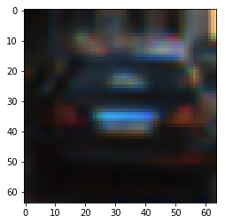|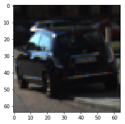|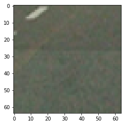|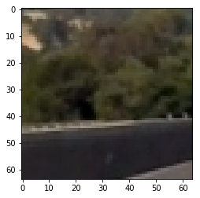|
|:-:|:-:|:-:|:-:|
|*Vehicle image 1*|*Vehicle image 2*|*Non-vehicle image 1*|*Non-vehicle image 2*|

The image is broken out into it's individual colour channels, and the histogram of each channel is computed.

```python
y_hist = np.histogram(feature_image[:,:,0], bins=32)
u_hist = np.histogram(feature_image[:,:,1], bins=32)
v_hist = np.histogram(feature_image[:,:,2], bins=32)
```

The number of bins chosen is a trade-off between having the full distribution of colour intensity of each channel versus the time it takes to process the feature vector during training. Here, 32 bins is chosen, meaning each bin contains `256 / 32 = 8` bits of information.

##### Vehicle images
The histograms illustrate that there is a similarity in the distribution of information for each of the colour channels between the two vehicle images. We can assume then that this is useful information to train the classifier.

###### Vehicle 1
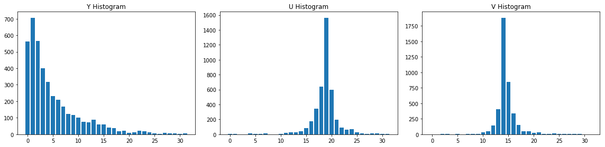

###### Vehicle 2
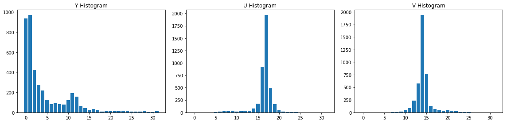

##### Non-vehicle images
The non-vehicle images show less of a correlation between them, but they are both distinctly different when compared to the vehicle images above, so should help to train the classifier to tell them apart.

###### Non-vehicle 1
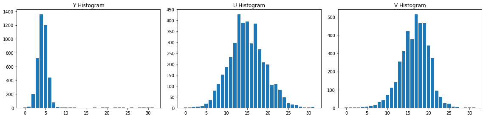

###### Non-vehicle 2
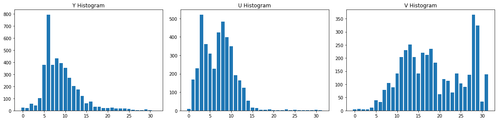

#### Spatial binning
The second feature vector is acquired by binning neighbouring pixels. This can be achieved simply by reducing the image resolution using an interpolation algorithm. As before, with a reduced resolution, the feature vector is smaller and requires less computational effort to process - so long as the classifier still has enough information to discern between vehicle and non-vehicle images.

To illustrate the construction of this feature vector, the below animation shows the R, G and B channels of an image with a pixel resolution of 4x4. The image is first resized to a 2x2 RGB image by averaging across neighbouring groups of 2x2 pixels. Then each channel is stacked horizontally making a 2x6 matrix. Finally the matrix is flattened out to the final feature vector.


The 64x64 and resized vehicle and non-vehicle images are shown with their respective feature vectors below. The graphs illustrate the respective flattened feature vector.

To construct the feature vector for the resized images, each of the colour channels are stacked using `np.hstack()` and flattened using `ravel()`.

```python
ch0_bins = cv2.resize(feature_image[:,:,0], 32, cv2.INTER_LINEAR)
ch1_bins = cv2.resize(feature_image[:,:,1], 32, cv2.INTER_LINEAR)
ch2_bins = cv2.resize(feature_image[:,:,2], 32, cv2.INTER_LINEAR)
features = np.hstack((ch0_bins, ch1_bins, ch2_bins))
features.ravel()
```

By the time the images are scaled down by a factor of 4 (16x16), the vehicle image data is starting to look more like noise. And for the 8x8 images, the classifier may struggle to identify any unique characteristics between the two classes.

##### 64x64
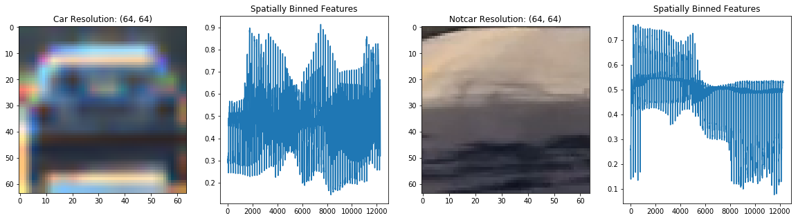

##### 32x32
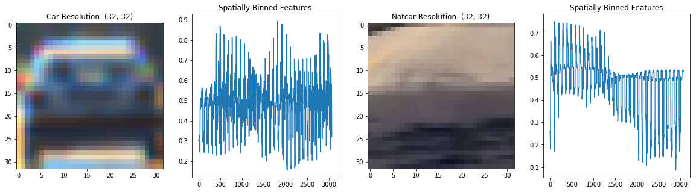

##### 16x16
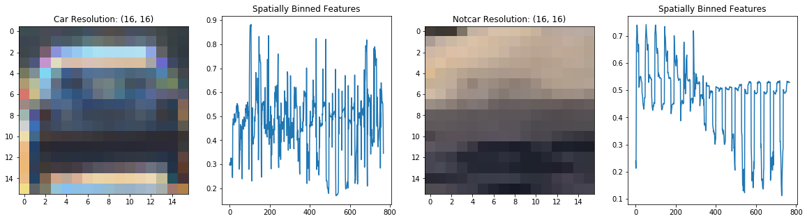

##### 8x8
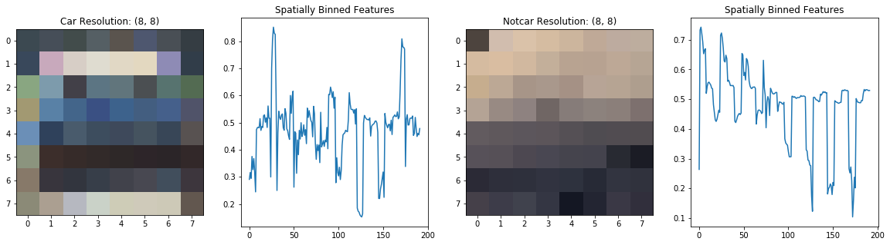

#### Histograms of oriented gradients
The third and final feature vector is a HOG: a distribution of directions of gradients of an image. The magnitude of a gradient is largest when neighbouring pixels show the maximum change in intensity. High magnitude gradients signify edges and corners that can be used to determine an object's shape. A description of HOG can be found [here](http://scikit-image.org/docs/dev/auto_examples/features_detection/plot_hog.html) and the `skimage.feature.hog()` function used for this project is detailed [here](http://scikit-image.org/docs/dev/api/skimage.feature.html#skimage.feature.hog).

```python
hog(ch0_bins, orientations=6, pixels_per_cell=(8, 8), cells_per_block=(2, 2),
    visualise=True)
```

The below visualisation shows that once `hog()` is applied to an image, each cell contains 6 gradient directions, each with a brightness corresponding to the strength of the gradient found in the corresponding cell of the original image. By assigning `feature_vec=True` in the function call to `hog()`, a flattened feature vector is returned, which can be used directly for training.

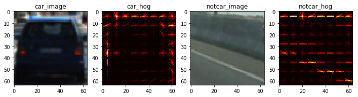

---
## Training the Classifier
### Introduction
The chosen classifier was a Linear SVM, `sklearn.svm.LinearSVC`. The above set of features were extracted from each of the two labelled datasets, vehicles and non-vehicles. I ensured there was a balanced dataset, with roughly the same number of examples of each class to avoid the classifier from favouring one class over the other when making predictions. Later in the project, I added some of my own non-vehicle examples to combat false positive predictions (more on that later).

### Parameters
```python
# Parameters
spatial_params = {
    'conv' : 'RGB2YUV',
    'size' : (32, 32)
}

hoc_params = {
    'conv' : 'RGB2YUV',
    'bins' : 32
}

hog_params = {
    'conv' : 'RGB2YUV',
    'channels' : [0, 1, 2],
    'orientations' : 6,
    'pix_per_cell' : 8,
    'cell_per_block' : 2
}
```

#### Normalisation
I extracted and normalised all the feature vectors using zero mean and unit variance to avoid any features from dominating classification during training.
```python
# Feature extraction
car_features = extract_features(vehicle_images, spatial_params, hoc_params, hog_params)
notcar_features = extract_features(nonvehicle_images, spatial_params, hoc_params, hog_params)

# Create an array stack of feature vectors
X = np.vstack((car_features, notcar_features)).astype(np.float64)
# Fit a per-column scaler
X_scaler = StandardScaler().fit(X)
# Apply the scaler to X
scaled_X = X_scaler.transform(X)
```

#### Train/test split
I split the data between a training set and a test set (10%) to avoid over-fitting and improve generalisation. This was done using the sklearn `train_test_split()` function. This function also shuffles the dataset before training to avoid any dependencies in ordering that might affect the accuracy of the classifier.
```python
# Define a labels vector based on features lists
y = np.hstack((np.ones(len(car_features)),
               np.zeros(len(notcar_features))))

# Split up data into randomized training and test sets
rand_state = np.random.randint(0, 100)
X_train, X_test, y_train, y_test = train_test_split(
    scaled_X, y, test_size=0.1, random_state=rand_state)
```

#### Linear SVM
Finally, the SVM is trained using the data.
```python
svc = LinearSVC()
svc.fit(X_train, y_train)
```

#### Accuracy
With a feature vector length of **6696**, that took just under 2 minutes to compute, the test accuracy of the classifier that was used to process the final video was **99.33%**.

---
## Pipeline implementation
### Introduction
There are two classes used to perform the vehicle detection and tracking algorithms. The first is `VehicleTracking`, which implements the main processing pipeline:
```python
class VehicleTracking(object):
    def pipeline(self, image):
        self.frame_image = image
        self.init() # initialise instance variables
        self.detect() # perform window search and predict vehicle detections
        self.track() # update vehicle tracking objects
        self.draw() # draw bounding boxes around tracked vehicles
        return self.draw_image
```

When `VehicleTracking` is instantiated it is passed the trained classifier, as well as the scaler, to ensure the features extracted from each frame are processed as they were during training. It is also passed the parameters used during feature extraction prior to training, and some additional parameters that configures how the vehicle search algorithm behaves.

The `VehicleTracking` class uses a second class, `Vehicle`, to create unique objects for the vehicle detections that can be used to collect and store relevant data about that detection. The algorithm differentiates between detected vehicles, a list of detections in any given frame, and tracked vehicles, a list of vehicle objects that have been detected across several frames.

An instance of the `Vehicle` class buffers its data over several frames for two reasons:
1. By buffering whether or not the instance was detected over this and past frames, decisions about tracking and displaying the instance can be made
2. By buffering the position of the vehicle object over multiple frames, smoothing can be applied to the bounding box that is drawn around the detection

### Pipeline summary
* For each frame of video, run a search for cars using a sliding window technique
* Wherever the classifier returns a positive detection, record the position of the window that the detection was made
* For overlapping detections, assign the position of the detection to the centroid of the overlapping windows
* For false positives, filter out by detecting them as transients from one frame to the next
* Once a high confidence detection has been reached, record how the centroid moves from one frame to the next

### Initialisation
Once the incoming frame has been captured, `self.frame_image = image`, the first step is to initialise the state of the detection and tracking algorithms.
```python
def init(self):
    self.detected_vehicles = []
    self.heatmap = None
    self.window_image = np.copy(self.frame_image)
    self.draw_image = np.copy(self.frame_image)
```

### Detection
#### Overview
The detection stage uses a `find_vehicles()` function to perform a sliding window search across the image, where each window is processed by the classifier to make its prediction. Each positive prediction gets added to a heatmap of detections that determines the overall confidence that any one pixel represents part of a vehicle. A confidence threshold can then be set to make the final decision over whether a vehicle has or has not been detected.

#### Sliding windows
Several window schemes can be used during the search by varying window sizes, how much the windows overlap during the search, and the region in the image to search over. The following image demonstrates three schemes. At the end, the heatmaps can be combined into a single heatmap from which the decision can be made.

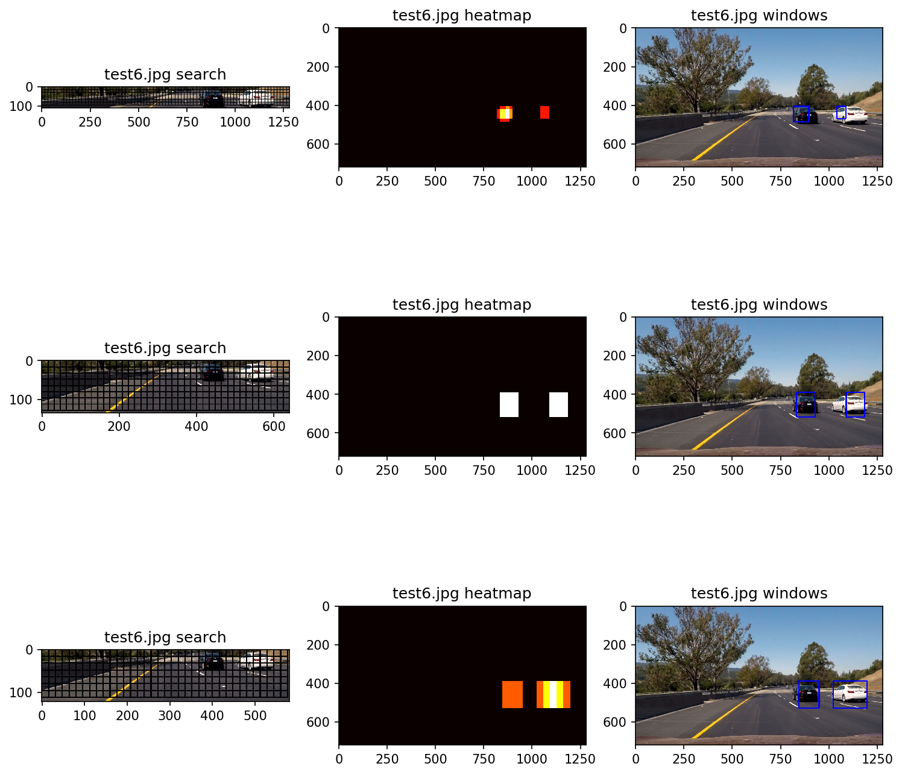

#### HOG sub-sampling
As HOG is more efficiently computed on the entire image rather than on each sliding window, the HOG features are extracted before entering the sliding window search where the remaining features are extracted. Because this happens outside the window search, to detect vehicles of different sizes, the image itself must be scaled up or down before perform HOG feature extraction. Thus, the window size is held constant across each window search.

#### Heatmaps and labelling
Once predictions have been made using several scales, their respective heatmaps are combined using an equal weighting. This produces one heatmap for a single frame containing clusters of positive detections. As some of these could be false positive detections by the classifier, the heatmap is processed to remove positive predictions in a given cell if it falls below a threshold parameter.

The heatmap is then labelled using the `scipy.ndimage.measurements.label` function, where every isolated cluster of positive predictions is given a unique number in the image matrix.

#### Vehicle objects
The final stage in the detection algorithm is to iterate through each unique label and create a corresponding `Vehicle` object that stores the coordinates of the detection.

### Tracking
#### Overview
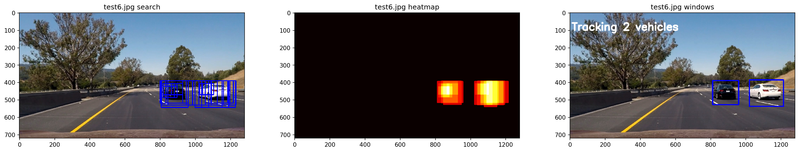

The tracking stage uses the compiled list of detected vehicles from this frame, and a compiled list of tracked vehicles from previous frames, to first determine: Does a new detection correspond to any vehicle object that is already being tracked? Thus, new detections are merged with tracked vehicles where appropriate, and any remaining detections are added to the list of tracked vehicles as new objects. The merging process essentially updates the tracked vehicle objects coordinates with the ones detected in the new frame.

#### Object states
With an updated list of tracked vehicle objects, the next step is to update the status of each object. The possible states are:

||Detected|Not Detected|
|:-:|:-:|:-:|
|**Display**|Indicates a tracked vehicle has been seen in the current frame and will be displayed|Indicates a tracked vehicle has not been seen in the current frame but will still be displayed - may be a stale detection object|
|**Don't Display**|Indicates a newly detected vehicle that won't be displayed until it is a confirmed positive detection over several frames|Indicates a previously tracked vehicle that can no longer be found - detection object can be deleted|

Vehicles in the display state can move to don't display if the number of detections over several frames drops below a threshold - this is set to anything under 80% of the buffer size. If a tracked vehicle has no positive detections left in its buffer, it gets deleted.

#### Filtering false positives
The displaying of new detections is delayed by two frames, so that false positives can be detected. Only once a new object is positively detected over 2 successive frames will it be displayed. An object that is detected in one frame, not detected in the next frame, and that has no other detections in its buffer, is treated as a false positive and deleted.

### Drawing
The final stage is to iterate through all the tracked vehicles to be displayed, and use their buffered coordinates to draw bounding boxes. The buffered coordinates are averaged to find a best fit. Also, the number of tracked vehicles is overlaid on the final image output from the pipeline.

---
## Final thoughts
The overall algorithm works well but suffers from several drawbacks:
* The algorithm is quite slow
  * SVM gives good accuracy but may not be the fastest classification algorithm to use
  * Extracting HOG features is costly, so more careful consideration of the region to extract from could cut down the time
* Positive detections of vehicles reaching a certain distance from the camera taper off
  * This can be mitigated by lowering the heatmap threshold parameter, but this increases the number of false positives
  * Another method for lowering false positives could help in this regard - possibly exploring other features to extract
* The camera will have image distortion that was not corrected in this pipeline, which if implemented could help to increase the prediction accuracy
